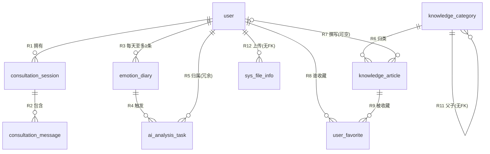

# 数据库表关系说明

> **库名**：`mental_health_assistant`（MySQL 5.7.39，字符集 `utf8mb4_unicode_ci`）
> **核对基准**：HEAD `9d5dea3`（已完善管理端日记查询），核对日期 2026-09-21
> **数据来源**：全部由 `SHOW CREATE TABLE` + `information_schema.KEY_COLUMN_USAGE` 实查得出，非凭设计稿推断
> **表规模**：9 张表、**9 条物理外键**、3 条逻辑关联、1 条多对多派生关系（R10）

---

## 0. 怎么读这份文档

### 0.1 术语约定

| 术语 | 含义 |
|---|---|
| **主表（父表）** | 被引用的一方。外键字段**不在**它身上，它的主键被别人指 |
| **从表（子表）** | 持有外键的一方。外键字段写在它身上 |
| **物理外键** | 库里有真实 `FOREIGN KEY` 约束，插入脏数据会被数据库**拒绝** |
| **逻辑关联** | 有字段、有业务含义，但**没有** FK 约束，一致性靠应用层自己保证 |
| **多重性** | 一条主表记录对应几条从表记录：`1:1` / `1:N` / `M:N` |

### 0.2 多重性记号

| 记号 | 读法 | 在 Mermaid 里 |
|---|---|---|
| `1 : 1` | 一对一 | `\|\|--\|\|` |
| `1 : N` | 一对多（N 可为零） | `\|\|--o{` |
| `1 : 0..1` | 一对零或一（外键可空） | `\|o--o{` |
| `M : N` | 多对多（必有中间表） | `}o--o{` |

> 图里 `||` 一侧是"必有一方"，`o` 表示可空，`{` / `}` 表示"多"。

### 0.3 引用约定（避免改文档时引用失效）

| 约定 | 说明 |
|---|---|
| **关系编号 `R1`~`R13` 是稳定 ID** | 只增不改。正文里互相引用**一律用 `R` 编号**，不要用小节号 |
| 小节号与 R 编号**不一一对应** | 关系 R1~R7 → 4.1~4.7；R8/R9/R10 合并成 4.8；R11~R13 → 4.9~4.11。原因是"R8+R9 合起来才是 R10（多对多）"，拆开讲反而乱 |
| 关系废弃 | 标成「~~R_x~~ 已废弃」并保留编号，**不重新编号**，否则全文交叉引用全废 |
| 查表关系 | 先查**第 3 节**（速查表），再看 **第 5 节**（按表名反查） |

---

## 1. 表清单总览

| # | 表名 | 中文名 | 主键 | 代码落点（实体 / Mapper） | 状态 |
|---|---|---|---|---|---|
| 1 | `user` | 用户表 | `id` bigint 自增 | `User` / `UserMapper` | 已实现 |
| 2 | `consultation_session` | 咨询会话表 | `id` bigint 自增 | `ConsultationSession` / `ConsultationSessionMapper` | 已实现 |
| 3 | `consultation_message` | 咨询消息表 | `id` bigint 自增 | `ConsultationMessage` / `ConsultionMessageMapper` | 已实现 |
| 4 | `emotion_diary` | 情绪日记表 | `id` bigint 自增 | `EmotionDiary` / `EmotionDiaryMapper` | 已实现 |
| 5 | `ai_analysis_task` | AI 分析任务表 | `id` bigint 自增 | `AiAnalysisTask` / **无 Mapper** | 实体已建，第 9 章待实现 |
| 6 | `knowledge_category` | 知识文章分类表 | `id` bigint 自增 | `KnowledgeCategory` / `KnowledgeCategoryMapper` | 已实现 |
| 7 | `knowledge_article` | 知识文章表 | `id` **varchar(36) UUID** | `KnowledgeArticle` / `KnowledgeArticleMapper` | 已实现 |
| 8 | `user_favorite` | 用户收藏表 | `id` bigint 自增 | **无实体、无 Mapper** | 表在，代码未实现 |
| 9 | `sys_file_info` | 系统文件信息表 | `id` bigint 自增 | `SysFileInfo` / `SysFileInfoMapper` | 已实现 |

> 命名注意：实体/Mapper 所在包名是 `mappper`（**三个 p**，故意的）；
> `ConsultionMessageMapper` 少了一个 `s`（历史拼写，未修正）。
> 全项目**没有 mapper XML**，全部走 MyBatis-Plus 注解 + `LambdaQueryWrapper`。

对应 Controller：`UserController`、`PsychologicalChatController`、`EmotionDiaryController`、`KnowledgeController`、`FileController`。

---

## 2. 关系总图



**R10（多对多）不单独画线**：`user` ↔ `knowledge_article` 的多对多是由 `user_favorite` 这张中间表把 R8 + R9 合起来实现的，画两条线已经表达了结构。

`sys_file_info` 的 **R13（多态指向任意业务表）无法用 ER 图表达**——它指向哪张表由 `business_type` 运行时决定，详见 **R13（4.11 节）**。

---

## 3. 关系总表（速查）

### 3.1 物理外键（数据库强制，9 条）

| 编号 | 主表（被引用） | 从表（持 FK） | 多重性 | 关联字段 | 约束名 | 级联 |
|---|---|---|---|---|---|---|
| **R1** | `user` | `consultation_session` | **1 : N** | `consultation_session.user_id` → `user.id` | `consultation_session_ibfk_1` | `ON DELETE CASCADE` |
| **R2** | `consultation_session` | `consultation_message` | **1 : N** | `consultation_message.session_id` → `consultation_session.id` | `consultation_message_ibfk_1` | `ON DELETE CASCADE` |
| **R3** | `user` | `emotion_diary` | **1 : N**（每人每天 ≤ 1） | `emotion_diary.user_id` → `user.id` | `emotion_diary_ibfk_1` | `ON DELETE CASCADE` |
| **R4** | `emotion_diary` | `ai_analysis_task` | **1 : N** | `ai_analysis_task.diary_id` → `emotion_diary.id` | `fk_ai_task_diary` | `ON DELETE CASCADE` |
| **R5** | `user` | `ai_analysis_task` | **1 : N** | `ai_analysis_task.user_id` → `user.id` | `fk_ai_task_user` | `ON DELETE CASCADE` |
| **R6** | `knowledge_category` | `knowledge_article` | **1 : N** | `knowledge_article.category_id` → `knowledge_category.id` | `knowledge_article_ibfk_1` | 无（= `RESTRICT` 拦截） |
| **R7** | `user` | `knowledge_article` | **1 : N**（外键可空） | `knowledge_article.author_id` → `user.id` | `knowledge_article_ibfk_2` | 无（= `RESTRICT` 拦截） |
| **R8** | `user` | `user_favorite` | **1 : N** | `user_favorite.user_id` → `user.id` | `user_favorite_ibfk_1` | `ON DELETE CASCADE` |
| **R9** | `knowledge_article` | `user_favorite` | **1 : N** | `user_favorite.article_id` → `knowledge_article.id` | `user_favorite_ibfk_2` | `ON DELETE CASCADE` |

**R10（多对多）是上表的派生物，不是独立外键**：

| 编号 | 两端 | 多重性 | 实现方式 |
|---|---|---|---|
| **R10** | `user` ↔ `knowledge_article` | **M : N** | 由 **R8 + R9** 经中间表 `user_favorite` 合成；唯一键 `user_article_unique(user_id, article_id)` 保证不重复收藏 |

> 数一遍便于对账：**9 条 FK = 9 条关系（R1~R9）+ 1 条派生（R10）→ 关系总数 13 条（R1~R13）**。

### 3.2 逻辑关联（无 FK，3 条）

| 编号 | 主表（被引用） | 从表（持字段） | 多重性 | 关联字段 | 为什么没有 FK |
|---|---|---|---|---|---|
| **R11** | `knowledge_category` | `knowledge_category`（**自身**） | **1 : N** | `parent_id` → `id`（`0` = 顶层） | 建表时未加自引用约束，只有索引 `idx_parent_id` |
| **R12** | `user` | `sys_file_info` | **1 : N** | `sys_file_info.upload_user_id` → `user.id` | 未加约束，只有索引 `idx_upload_user` |
| **R13** | **任意业务表** | `sys_file_info` | **1 : N**（多态） | `(business_type, business_id)` → 目标表主键 | 目标表**运行时才确定**，FK 无法表达 |

### 3.3 关于「一对一」：本库当前**没有任何 1:1 关系**

9 张表之间**不存在**一对一。下面这三组最容易被误判成 1:1，这里明确排除：

| 易误判的组合 | 实际 | 判据 |
|---|---|---|
| `user` ↔ `consultation_session` | **1 : N** | `consultation_session` 上只有 `KEY idx_user_session(user_id, started_at)`，**没有** `UNIQUE(user_id)`。一个用户可以开任意多个会话 |
| `user` ↔ `emotion_diary` | **1 : N**（每人每天至多 1 条） | 唯一键是 **组合键** `UNIQUE(user_id, diary_date)`，约束的是"同一天"，不是"一辈子只有一条"。一个用户可以有 365 条日记 |
| `emotion_diary` ↔ `ai_analysis_task` | **1 : N** | `ai_analysis_task` 上只有 `KEY idx_diary_id`，**不是**唯一键。一条日记每提交一次就产生一条任务，历史任务保留 |

> 一句话记住：**判断 1:1 的唯一依据是"从表的外键列上有没有唯一约束"**，不是"业务上感觉应该是一条"。

---

## 4. 逐条详解

### 4.1 R1 · `user` 1 : N `consultation_session`

| 项 | 内容 |
|---|---|
| **主表** | `user`（`id`） |
| **从表** | `consultation_session`（`user_id`，`NOT NULL`） |
| **多重性** | **一对多** |
| **约束** | `consultation_session_ibfk_1`，`ON DELETE CASCADE` |
| **索引** | `idx_user_session(user_id, started_at)` —— 支撑"我的会话列表按时间排序" |

**业务含义**：一个用户拥有一条或多条心理对话会话。

**验证 SQL**

```sql
-- 存在一个用户多个会话 → 证明是 1:N
SELECT user_id, COUNT(*) AS sessions
  FROM consultation_session GROUP BY user_id HAVING COUNT(*) > 1;
```

**注意**：删用户会连带删除他所有会话（R1 CASCADE），进而连带删除所有消息（R2 CASCADE）。三层连锁删除，删用户前先想清楚。

---

### 4.2 R2 · `consultation_session` 1 : N `consultation_message`

| 项 | 内容 |
|---|---|
| **主表** | `consultation_session`（`id`） |
| **从表** | `consultation_message`（`session_id`，`NOT NULL`） |
| **多重性** | **一对多** |
| **约束** | `consultation_message_ibfk_1`，`ON DELETE CASCADE` |
| **索引** | `idx_session_message(session_id, created_at)` —— 支撑"拉某个会话的消息按时间正序" |

**业务含义**：消息是会话的明细表。`sender_type` 区分 1=用户 / 2=AI 助手。

**验证 SQL**

```sql
SELECT session_id, COUNT(*) AS msgs
  FROM consultation_message GROUP BY session_id ORDER BY msgs DESC LIMIT 5;
```

**注意**：这张表是**持久化的展示用历史**。Spring AI 的 `ChatMemory` 是另一份**进程内存**里的对话记忆（默认 `InMemoryChatMemoryRepository`），两者互不同步——服务重启后 AI 失忆，但这里的消息还在。做"AI 记得住"的功能时别把这份表当成记忆来源。

---

### 4.3 R3 · `user` 1 : N `emotion_diary`（每人每天 ≤ 1 条）

| 项 | 内容 |
|---|---|
| **主表** | `user`（`id`） |
| **从表** | `emotion_diary`（`user_id`，`NOT NULL`） |
| **多重性** | **一对多**，但**受唯一键收窄为"每人每天至多一条"** |
| **约束** | `emotion_diary_ibfk_1`，`ON DELETE CASCADE` |
| **唯一键** | `user_date_unique(user_id, diary_date)` ← **这条最容易被忽略** |
| **索引** | `idx_user_diary(user_id, diary_date)`、`idx_ai_analysis_time(ai_analysis_updated_at)` |

**业务含义**：用户的情绪日记。**唯一键决定了同一天再提交一次 = 覆盖更新（upsert），不是新增一条。**

**验证 SQL**

```sql
-- 恒为 0 行；若查出结果说明唯一键被人删了
SELECT user_id, diary_date, COUNT(*) FROM emotion_diary
 GROUP BY user_id, diary_date HAVING COUNT(*) > 1;
```

**注意**：正因为有这个唯一键，"用户能不能改日记"这个问题根本不用新增接口——同一个 `POST /api/emotion-diary` 打第二次就是改。删用户会连带删掉他全部日记（含 AI 分析结果）。

---

### 4.4 R4 · `emotion_diary` 1 : N `ai_analysis_task`

| 项 | 内容 |
|---|---|
| **主表** | `emotion_diary`（`id`） |
| **从表** | `ai_analysis_task`（`diary_id`，`NOT NULL`） |
| **多重性** | **一对多**（**不是一对一**） |
| **约束** | `fk_ai_task_diary`，`ON DELETE CASCADE` |
| **索引** | `idx_diary_id`（普通索引） |

**业务含义**：一条日记每被触发一次分析，就留下一条任务记录。同一天反复提交 → 日记始终一条，**任务不断累积**。这是刻意设计：任务表要当"分析历史 + 排障凭据"用。

**验证 SQL**

```sql
SELECT diary_id, COUNT(*) AS tasks, GROUP_CONCAT(status) AS statuses
  FROM ai_analysis_task GROUP BY diary_id ORDER BY tasks DESC;
```

**注意**：任务表上的 `ON DELETE CASCADE` 意味着**删日记会把排障留痕一起删掉**。这是 DDL 的既定取舍，不是 bug；如果以后要留档，需要先改约束。

---

### 4.5 R5 · `user` 1 : N `ai_analysis_task`（冗余外键）

| 项 | 内容 |
|---|---|
| **主表** | `user`（`id`） |
| **从表** | `ai_analysis_task`（`user_id`，`NOT NULL`） |
| **多重性** | **一对多** |
| **约束** | `fk_ai_task_user`，`ON DELETE CASCADE` |
| **索引** | `idx_user_id` |

**业务含义**：`user_id` 其实**可以由 R4 传递推出**（`task → diary → user`），放在任务是**冗余字段**，目的是让"按用户统计任务"少一次 join。

**代价**：数据库**不会**校验 `task.user_id` 与 `diary.user_id` 是否一致——应用层写错的脏数据 FK 拦不住。

**一致性检查 SQL（建议纳入巡检）**

```sql
SELECT t.id, t.user_id AS task_user, d.user_id AS diary_user
  FROM ai_analysis_task t JOIN emotion_diary d ON d.id = t.diary_id
 WHERE t.user_id <> d.user_id;   -- 当前 0 条，健康
```

---

### 4.6 R6 · `knowledge_category` 1 : N `knowledge_article`

| 项 | 内容 |
|---|---|
| **主表** | `knowledge_category`（`id`） |
| **从表** | `knowledge_article`（`category_id`，`NOT NULL`） |
| **多重性** | **一对多**（一篇文章只属于一个分类） |
| **约束** | `knowledge_article_ibfk_1`，**无 `ON DELETE` 子句 → 实际是 `RESTRICT`** |
| **索引** | `idx_category_article(category_id, published_at)` |

**业务含义**：文章归属分类。（文章上的 `tags` 是逗号分隔字符串，**不是**标签表关联——本库没有标签表。）

**注意**：`RESTRICT` 意味着**分类下还有文章时，删分类会被数据库拒绝**（错误码 1451）。删除前必须先挪走或删掉文章：

```sql
-- 会报错：Cannot delete or update a parent row
DELETE FROM knowledge_category WHERE id = 1;
```

---

### 4.7 R7 · `user` 1 : N `knowledge_article`（作者，外键可空）

| 项 | 内容 |
|---|---|
| **主表** | `user`（`id`） |
| **从表** | `knowledge_article`（`author_id`，**允许 NULL**） |
| **多重性** | **一对多**；因可空，一篇文章是"零个或一个作者" |
| **约束** | `knowledge_article_ibfk_2`，**无 `ON DELETE` → `RESTRICT`** |
| **索引** | `author_id` |

**业务含义**：`author_id = NULL` 表示系统生成 / 无署名的文章。

**注意（隐患）**：因为没有 `ON DELETE SET NULL`，**只要某个用户还挂着文章，就删不掉这个用户**——而 R1/R3/R8 都是 `CASCADE`，很容易让人以为"删用户很顺畅"。删用户前先处理：

```sql
-- 查有多少文章会拦住删除
SELECT COUNT(*) FROM knowledge_article WHERE author_id = <uid>;
-- 若确实要删，先把文章作者置空
UPDATE knowledge_article SET author_id = NULL WHERE author_id = <uid>;
```

---

### 4.8 R8 + R9 + R10 · `user` **M : N** `knowledge_article`（经 `user_favorite`）

| 项 | 内容 |
|---|---|
| **中间表** | `user_favorite`（`user_id` + `article_id`） |
| **两端** | `user_id` → `user.id`（R8，`CASCADE`）；`article_id` → `knowledge_article.id`（R9，`CASCADE`） |
| **多重性** | **多对多**：一个用户收藏多篇文章；一篇文章被多个用户收藏 |
| **去重约束** | `user_article_unique(user_id, article_id)` —— 同一用户对同一文章**只能收藏一次** |
| **索引** | `article_id` |

**为什么能算多对多**：中间表两端都是 `1:N`，且**没有任何一端带唯一约束单独收窄**（唯一键是组合的 `user_id + article_id`）。这正是标准多对多的判据。

**业务含义**：这张表本身带业务列 `created_at`（收藏时间），属于"有关联属性的关联表"，不只是纯映射。

**验证 SQL**

```sql
-- 收藏最多的文章 = 典型的多对多特征
SELECT article_id, COUNT(*) AS favs FROM user_favorite GROUP BY article_id ORDER BY favs DESC;
-- 收藏最多的用户同样多对多
SELECT user_id, COUNT(*) AS favs FROM user_favorite GROUP BY user_id ORDER BY favs DESC;
```

**注意（现状）**：`user_favorite` **没有任何 Java 代码引用**——无实体、无 Mapper、无 Service、无 Controller，全项目 grep 不到。**表已建好但收藏功能尚未实现。** 做的时候注意唯一键会抛重复键异常，插入前要判重（或 `INSERT IGNORE`）。

---

### 4.9 R11 · `knowledge_category` 1 : N `knowledge_category`（自关联树）

| 项 | 内容 |
|---|---|
| **主表 / 从表** | **同一张表**（`knowledge_category`） |
| **关联字段** | `parent_id` → `id`；**`0` 表示顶层**（不是 NULL） |
| **多重性** | **一对多**（一个父分类下多个子分类） |
| **约束** | **无物理 FK**（只有 `KEY idx_parent_id`） |

**业务含义**：分类是树形结构（支持多级）。

**注意**：

1. **`parent_id` 无 FK → 可能出孤儿**：数据库不保证父分类存在，删了父分类，子分类的 `parent_id` 会悬空且**不报任何错**。
2. **`0` 是魔法值**：顶层分类的 `parent_id = 0`，而不是 `NULL`。查顶层要写 `WHERE parent_id = 0`，写成 `IS NULL` 查不到东西。
3. **`category_code` 上有唯一键**（`UNIQUE(category_code)`），新增分类时编码不能重复。

```sql
-- 顶层分类有多少
SELECT COUNT(*) AS roots FROM knowledge_category WHERE parent_id = 0;

-- 孤儿分类巡检（parent_id 指向一个不存在的分类）
SELECT c.id, c.category_name, c.parent_id FROM knowledge_category c
  LEFT JOIN knowledge_category p ON p.id = c.parent_id
 WHERE c.parent_id <> 0 AND p.id IS NULL;
```

---

### 4.10 R12 · `user` 1 : N `sys_file_info`（上传者，逻辑关联）

| 项 | 内容 |
|---|---|
| **主表** | `user`（`id`） |
| **从表** | `sys_file_info`（`upload_user_id`，**允许 NULL**） |
| **多重性** | **一对多** |
| **约束** | **无物理 FK**（只有 `KEY idx_upload_user`） |

**业务含义**：记录文件是谁上传的。

**注意**：因为没有 FK，**删用户不会动这些文件记录**，`upload_user_id` 会变成悬空值。查孤儿：

```sql
SELECT f.id, f.original_name, f.upload_user_id FROM sys_file_info f
  LEFT JOIN user u ON u.id = f.upload_user_id
 WHERE f.upload_user_id IS NOT NULL AND u.id IS NULL;
```

---

### 4.11 R13 · `sys_file_info` N : 1 **多态业务对象**（无法用 FK 表达）

| 项 | 内容 |
|---|---|
| **关联字段** | `(business_type, business_id)` |
| **指向** | **运行时决定**：`business_type` 说要关联哪张业务表的哪个字段 |
| **多重性** | **一对多**（一个业务对象可挂多个文件）；方向是"多文件 → 一个业务对象" |
| **约束** | **无 FK**，也**不可能**有 FK（目标表不固定） |
| **索引** | `idx_business(business_type, business_id)` |

**实测的 `business_type` 取值**（实查库）：

| `business_type` | 指向 | 条数 |
|---|---|---|
| `USER_AVATAR` | `user.id`（`business_field` = `avatar`） | 5 |
| `ARTICLE` | `knowledge_article.id`（UUID） | 6 |
| `article_cover` | `knowledge_article.id`（封面图） | 2 |

**三个要注意的点**：

1. **命名不统一**：`ARTICLE` 是全大写，`article_cover` 是小写，`USER_AVATAR` 又是全大写。这是实际数据里的脏值，查询时必须 `WHERE business_type = 'ARTICLE'` 精确匹配，用 `=` 写错大小写就查不到。**建议后续统一成大写下划线风格。**
2. **`business_id` 类型不匹配**：列类型是 `char(255)`（字符串），但它要同时装 `user.id` 的 bigint 和 `knowledge_article.id` 的 UUID。跨表 `JOIN` 时 MySQL 会做隐式类型转换，**索引可能失效**。
3. **`business_id` 可以是 NULL**：实测有 2 条 `article_cover` 的 `business_id` 为空（上传了但还没绑定到文章），语义是"临时未归属文件"。

---

## 5. 按表索引（从表名反查）

> 每张表两张视角：**「指向」= 我持有外键指向别人（我是从表）；「被引用」= 别人持有外键指向我（我是主表）。**
> 叶子表只有「指向」行，核心主表只有「被引用」行。

### 5.1 `user`（本库的核心主表，被 6 处引用）

| 方向 | 关系 | 对方表 | 字段 | 多重性 | FK |
|---|---|---|---|---|---|
| 被引用 | R1 | `consultation_session` | `user_id` | 1 : N | 有（CASCADE） |
| 被引用 | R3 | `emotion_diary` | `user_id` | 1 : N | 有（CASCADE） |
| 被引用 | R5 | `ai_analysis_task` | `user_id` | 1 : N | 有（CASCADE） |
| 被引用 | R7 | `knowledge_article` | `author_id` | 1 : N（可空） | 有（RESTRICT） |
| 被引用 | R8 | `user_favorite` | `user_id` | 1 : N | 有（CASCADE） |
| 被引用 | R12 | `sys_file_info` | `upload_user_id` | 1 : N | **无** |

### 5.2 `consultation_session`

| 方向 | 关系 | 对方表 | 字段 | 多重性 | FK |
|---|---|---|---|---|---|
| 指向 | R1 | `user` | `user_id` | N : 1 | 有（CASCADE） |
| 被引用 | R2 | `consultation_message` | `session_id` | 1 : N | 有（CASCADE） |

### 5.3 `consultation_message`

| 方向 | 关系 | 对方表 | 字段 | 多重性 | FK |
|---|---|---|---|---|---|
| 指向 | R2 | `consultation_session` | `session_id` | N : 1 | 有（CASCADE） |

> 叶子表，不被任何人引用。

### 5.4 `emotion_diary`

| 方向 | 关系 | 对方表 | 字段 | 多重性 | FK |
|---|---|---|---|---|---|
| 指向 | R3 | `user` | `user_id` | N : 1 | 有（CASCADE） |
| 被引用 | R4 | `ai_analysis_task` | `diary_id` | 1 : N | 有（CASCADE） |

> 唯一键 `(user_id, diary_date)` → 对 `user` 是"每人每天至多一条"。

### 5.5 `ai_analysis_task`

| 方向 | 关系 | 对方表 | 字段 | 多重性 | FK |
|---|---|---|---|---|---|
| 指向 | R4 | `emotion_diary` | `diary_id` | N : 1 | 有（CASCADE） |
| 指向 | R5 | `user` | `user_id` | N : 1 | 有（CASCADE，**冗余**） |

> 本库有**两张表同时挂两个父表**（另一张是 `user_favorite`）。区别在于：这里的 `user_id` 是**冗余**的——它可由 `diary_id` 传递推出，见 4.5 与 R5。叶子表，不被任何人引用。

### 5.6 `knowledge_category`

| 方向 | 关系 | 对方表 | 字段 | 多重性 | FK |
|---|---|---|---|---|---|
| 指向 | R11 | `knowledge_category`（自己） | `parent_id` | N : 1 | **无** |
| 被引用 | R6 | `knowledge_article` | `category_id` | 1 : N | 有（RESTRICT） |
| 被引用 | R11 | `knowledge_category`（自己） | `parent_id` | 1 : N | **无** |

### 5.7 `knowledge_article`

| 方向 | 关系 | 对方表 | 字段 | 多重性 | FK |
|---|---|---|---|---|---|
| 指向 | R6 | `knowledge_category` | `category_id` | N : 1 | 有（RESTRICT） |
| 指向 | R7 | `user` | `author_id` | N : 0..1 | 有（RESTRICT） |
| 被引用 | R9 | `user_favorite` | `article_id` | 1 : N | 有（CASCADE） |
| 被引用 | R13 | `sys_file_info` | `business_id`（`business_type='ARTICLE'`） | 1 : N | **无**（多态） |

> 主键是 `varchar(36)` UUID，由应用层生成（`IdType.INPUT`），不是自增。

### 5.8 `user_favorite`

| 方向 | 关系 | 对方表 | 字段 | 多重性 | FK |
|---|---|---|---|---|---|
| 指向 | R8 | `user` | `user_id` | N : 1 | 有（CASCADE） |
| 指向 | R9 | `knowledge_article` | `article_id` | N : 1 | 有（CASCADE） |

> **多对多的中间表**。唯一键 `(user_id, article_id)` 保证不重复收藏。

### 5.9 `sys_file_info`

| 方向 | 关系 | 对方表 | 字段 | 多重性 | FK |
|---|---|---|---|---|---|
| 指向 | R12 | `user` | `upload_user_id` | N : 1 | **无** |
| 指向 | R13 | 任意业务表（多态） | `(business_type, business_id)` | N : 1 | **无**（不可能有） |

> **零外键表**：两条关联全是逻辑的，删任何东西它都不受影响，但也永远可能悬空。

---

## 6. 删除行为矩阵（维护重点）

删一行会连带发生什么——**这张表比外键清单更常用**。

| 删除操作 | 级联删除（CASCADE） | 被拦截（RESTRICT） |
|---|---|---|
| `DELETE FROM user` | `consultation_session` → 连带 `consultation_message`；`emotion_diary` → 连带 `ai_analysis_task`；`user_favorite` | **`knowledge_article`**（若 `author_id` 指向它）→ 报 `1451`，删不掉 |
| `DELETE FROM consultation_session` | `consultation_message` | — |
| `DELETE FROM emotion_diary` | `ai_analysis_task`（**排障留痕一起丢**） | — |
| `DELETE FROM knowledge_article` | `user_favorite` | — |
| `DELETE FROM knowledge_category` | — | **`knowledge_article`**（若 `category_id` 指向它）→ 报 `1451` |
| `DELETE FROM knowledge_category`（作为父分类） | — | — （`parent_id` 无 FK，**子分类会变成孤儿，不报错**） |
| `DELETE FROM sys_file_info` | — | — （零 FK，随便删） |
| `DELETE FROM ai_analysis_task` | — | — （叶子表） |

> 记忆点：**`user` 和 `knowledge_category` 是"删不干净"的两个**——分别被 R7 和 R6 挡住。

---

## 7. 维护指引

### 7.1 一键重查全部外键（改表后跑这条，结果直接对齐第 3.1 节）

```sql
SELECT k.TABLE_NAME      AS 从表,
       k.COLUMN_NAME     AS 从表字段,
       k.REFERENCED_TABLE_NAME  AS 主表,
       k.REFERENCED_COLUMN_NAME AS 主表字段,
       k.CONSTRAINT_NAME AS 约束名,
       r.DELETE_RULE     AS 删除行为
  FROM information_schema.KEY_COLUMN_USAGE k
  JOIN information_schema.REFERENTIAL_CONSTRAINTS r
    ON r.CONSTRAINT_SCHEMA = k.TABLE_SCHEMA AND r.CONSTRAINT_NAME = k.CONSTRAINT_NAME
 WHERE k.TABLE_SCHEMA = 'mental_health_assistant'
   AND k.REFERENCED_TABLE_NAME IS NOT NULL
 ORDER BY k.TABLE_NAME, k.CONSTRAINT_NAME;
```

### 7.2 一键重查业务唯一键（判断 1:1 / 去重约束）

> 一定要加 `INDEX_NAME <> 'PRIMARY'`，否则主键会混进结果，把噪音当信号。

```sql
SELECT TABLE_NAME, INDEX_NAME,
       GROUP_CONCAT(COLUMN_NAME ORDER BY SEQ_IN_INDEX) AS cols
  FROM information_schema.STATISTICS
 WHERE TABLE_SCHEMA = 'mental_health_assistant'
   AND NON_UNIQUE = 0
   AND INDEX_NAME <> 'PRIMARY'          -- 只看业务唯一键
 GROUP BY TABLE_NAME, INDEX_NAME
 ORDER BY TABLE_NAME;
```

**当前全部业务唯一键（实查结果，共 6 条）**：

| 表 | 唯一键名 | 字段 | 作用 |
|---|---|---|---|
| `user` | `username` | `username` | 用户名不可重复 |
| `user` | `email` | `email` | 邮箱不可重复 |
| `user` | `phone` | `phone` | 手机号不可重复 |
| `emotion_diary` | `user_date_unique` | `user_id, diary_date` | **每人每天至多一条日记** |
| `knowledge_category` | `category_code` | `category_code` | 分类编码唯一 |
| `user_favorite` | `user_article_unique` | `user_id, article_id` | **不重复收藏** |

> 按类型分：**单列唯一键 4 条**（`user` 的 `username` / `email` / `phone`，`knowledge_category` 的 `category_code`）；
> **组合唯一键 2 条**（`emotion_diary.user_date_unique`、`user_favorite.user_article_unique`）。
> 只有"从表的**外键列**上挂着单列唯一键"才构成 1:1 —— 本库没有这种情况（`user` 那 3 条单列唯一键挂的是业务列，不是外键）。

### 7.3 变更检查清单

动了表结构，**必须**同步本文档：

| 变更类型 | 要更新哪些节 |
|---|---|
| 新建一张表 | 第 1 节表清单、第 2 节关系图、第 3 节关系总表、第 4 节新增详解、第 5 节按表索引 |
| 新增一个外键 | 第 3 节编号顺延（R14…）、第 4 节详解、第 5 节两端表的索引、**第 6 节删除矩阵** |
| 新增唯一键 | 第 3.3 节（可能把某个 1:N 收窄成 1:1）、对应表的详解 |
| 新增实体/Mapper | 第 1 节"代码落点"与"状态"列 |
| 改了 `ON DELETE` 行为 | **第 6 节删除矩阵**（最容易被忘、后果最大的一节） |

> 编号约定：**关系编号 `R1`~`R13` 只增不改**。删掉的关系统一标记为「~~R_x~~ 已废弃」而不是重新编号，避免正文里的交叉引用失效。

### 7.4 当前已知不一致 / 待办

| # | 项 | 现状 | 建议 |
|---|---|---|---|
| 1 | `user_favorite` 无任何 Java 代码 | 表已建、1 行数据，但全项目零引用 | 实现收藏功能时补实体 + Mapper + 唯一键判重 |
| 2 | `sys_file_info.business_type` 大小写不统一 | 实际值：`ARTICLE` / `article_cover` / `USER_AVATAR` | 统一为大写下划线；查询处改用常量而非字面量 |
| 3 | `user` 与 `knowledge_category` 缺删除策略 | `RESTRICT` 会导致"删不掉"，报 1451 | 明确业务取舍：要么改 `SET NULL`/`CASCADE`，要么在 Service 里先做前置处理并给出友好提示 |
| 4 | `knowledge_category.parent_id` 无 FK | 可能出现悬空父分类 | 至少加一条巡检 SQL（见 4.9） |
| 5 | `ai_analysis_task.user_id` 冗余 | 可由 `diary_id` 推出，DB 不校验一致 | 保持冗余但把一致性检查纳入巡检（见 4.5） |
| 6 | `ai_analysis_task` 代码未完成 | 实体已建；Mapper / Service / Scheduler 未建 | 见 `待实现接口-实现指南.md` 第 9 章 |
| 7 | 无表注释级的"关系说明" | 全靠本文档 | 变更时按 7.3 清单更新 |

---

### 7.5 基线快照（2026-09-21，用于日后比对）

各表行数：

| 表 | 行数 | 表 | 行数 |
|---|---|---|---|
| `user` | 4 | `knowledge_category` | 8 |
| `consultation_session` | 6 | `knowledge_article` | 7 |
| `consultation_message` | 14 | `user_favorite` | 1 |
| `emotion_diary` | 1 | `sys_file_info` | 13 |
| `ai_analysis_task` | 0 | | |

巡检结果（**这些都是"正常"的取值，变了才要查**）：

| 巡检项（SQL 见对应节） | 期望 | 2026-09-21 实测 |
|---|---|---|
| R3 唯一键是否被违反（4.3） | 0 行 | 0 行 ✔ |
| R5 冗余 `user_id` 是否不一致（4.5） | 0 行 | 0 行 ✔ |
| R11 孤儿分类（4.9） | 0 行 | 0 行 ✔ |
| R12 孤儿文件（4.10） | 0 行 | 0 行 ✔ |
| 顶层分类数（4.9） | 常规 | 6 |
| 有多个会话的用户（4.1） | 存在即证明 1:N | `user_id=2` 有 5 个会话 |

> 数字本身会变（正常增长），**只有"巡检项从 0 行变成非 0 行"才是异常信号**。

---

## 附：关系一句话总结

```
user ─┬─1:N─> consultation_session ─1:N─> consultation_message
      ├─1:N─> emotion_diary ─1:N─> ai_analysis_task ─(冗余 user_id)─> user
      ├─1:N─> knowledge_article ─N:1─> knowledge_category ─1:N─> 自己(parent_id, 无FK)
      │                          └─N:1─> user(author_id, 可空)
      ├─1:N─> sys_file_info ─N:1(多态, 无FK)─> 任意业务表
      └─M:N─> knowledge_article   (经中间表 user_favorite)

唯一的多对多：user ←→ knowledge_article
唯一的自关联：knowledge_category.parent_id
唯一的一对一：无
```
